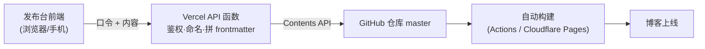

# Firefly 博客实战：从零搭建任意设备可用的发布台（Vercel + GitHub API）

> 静态博客的一切内容都是 Git 仓库里的 Markdown 文件，代价是：想发篇文章，你得坐在装好开发环境的电脑前。这篇讲我们怎么把"发布"这件事拆出来，做成一个**任何设备打开浏览器就能用**的独立系统——发文、改稿、删除、预览，全部不用碰 git。

## 一、需求与架构选型

目标拆开来是三句话：

1. 博客本体**一行架构都不动**（继续是纯静态站 + 自动构建）
2. 发布系统**独立部署**，有登录，手机能用
3. 发布动作最终**落回 Git 仓库**，触发既有的自动构建上线

这就是所谓的"前后端分离"在静态博客语境下的含义：**博客 = 展示层（静态产物），发布台 = 独立的前后端（编辑界面 + API）**，中间靠 GitHub 仓库衔接。



为什么走 Git 而不是数据库？因为博客的内容层（content collections、文件名序号、frontmatter 约定）全部建立在文件上，搬进数据库等于推翻重建；而发布频率很低的个人博客，**每次发布等 3~5 分钟构建完全可以接受**。这条路只动"发布入口"，不动"内容模型"，风险最低。

## 二、准备工作

开始前你需要：

1. **一个静态博客仓库**（本文以 Firefly / Astro 为例，其他静态站同理）
2. **Vercel 账号**（ Hobby 免费版足够）
3. **GitHub Fine-grained PAT**（精细访问令牌）：
   - 打开 GitHub → **Settings**（设置）→ **Developer settings** → **Personal access tokens** → **Fine-grained tokens** → **Generate new token**
   - **Repository access**（仓库范围）→ Only select repositories → 只勾你的博客仓库
   - **Permissions**（权限）→ Repository permissions → **Contents** 设为 **Read and write**，其他一律不动
   - 生成后**立刻复制**，只显示这一次
4. **一个发布口令**：自己想一串随机字符串（比如 `firefly-xxxx-xxxx`），它是发布台的登录密码，后面存进 Vercel 环境变量

> PAT 只授单仓库的 Contents 写权限，就算泄露，损失也被锁死在"有人能往你博客仓库提交内容"这一件事上——这是整套设计里最关键的一条安全边界。

## 三、后端：五个函数就是全部

发布台后端不用任何框架，Vercel 支持**纯函数**：在项目目录下建 `api/` 文件夹，每个 `.js` 文件就是一个 HTTP 端点。最终结构：

```
publisher/
├── index.html          # 发布台单页（登录/发布/管理三视图）
├── app.js              # 前端逻辑
├── package.json        # {"type":"module"}，加一个空 build 脚本
├── vercel.json         # 锁定输出目录（防根配置串扰，见第五节）
├── lib/shared.js       # 端点公共工具
└── api/
    ├── auth.js         # POST   登录校验
    ├── publish.js      # POST   发布新内容
    ├── articles.js     # GET    内容列表（管理页用）
    └── article.js      # GET/PUT/DELETE  单篇读、存、删
```

### 3.1 鉴权：每个请求都要过口令

口令存环境变量 `PUBLISH_TOKEN`，前端登录成功后把口令放在请求头 `x-publish-token` 里带上，服务端逐次校验。比较要用常数时间函数，避免时序侧信道：

```js
import crypto from "node:crypto";

export function safeEqual(a, b) {
	const ab = Buffer.from(String(a ?? ""), "utf8");
	const bb = Buffer.from(String(b ?? ""), "utf8");
	if (ab.length !== bb.length) return false;
	return crypto.timingSafeEqual(ab, bb);
}

// 每个端点的第一段逻辑
const publishToken = process.env.PUBLISH_TOKEN;
if (!safeEqual(req.headers["x-publish-token"], publishToken)) {
	res.statusCode = 401;
	res.end(JSON.stringify({ ok: false, error: "口令错误" }));
	return;
}
```

会话策略用 **sessionStorage**（存标签页内存，关浏览器即失效）而不是 localStorage，就实现了"每次打开发布台都要登录"。

### 3.2 发布端点：命名、frontmatter、提交三件事

发布端点收到 `{ type, title, content, ...可选字段 }` 后做三件事：

**① 自动命名**——这是"文件名序号"类博客的关键。发文章前先调 GitHub Contents API 列目录，正则抓所有 `数字+文章.md` 取最大值 +1：

```js
const res = await fetch(
	`https://api.github.com/repos/${REPO}/contents/src/content/posts/txt?ref=${BRANCH}`,
	{ headers: { Authorization: `Bearer ${token}` } },
);
const entries = await res.json();
let max = 0;
for (const e of entries) {
	const m = /^(\d+)文章\.md$/.exec(e.name);
	if (m) max = Math.max(max, Number(m[1]));
}
const path = `src/content/posts/txt/${max + 1}文章.md`;
```

更新公告按日期命名（`更新公告20261003.md`）、动态按时间戳命名（`20261003-1217.md`），同名冲突就追加 `-2` 后缀。**命名规则永远现场查仓库算，不要缓存**，这样本地手动加了文件它也不会撞车。

**② 拼 frontmatter**——两条容易翻车的经验：

- **字符串一律用 `JSON.stringify` 转义**：标题里的引号、冒号、特殊字符，`JSON.stringify` 输出的就是合法 YAML 双引号字符串，手写拼接迟早被一个带 `:` 的标题弄炸
- **日期裸写、不要引号**：`published: 2026-10-03` 会被 YAML 解析成 Date 对象（Zod schema 的 `z.date()` 才认）；写成 `published: "2026-10-03"` 就成了字符串，构建直接报 schema 错误

```js
const lines = ["---", `title: ${JSON.stringify(title)}`, `published: ${now.date}`];
// 约定"留空不写"：可选字段没填就完全不出现在 frontmatter 里
if (fields.tags.length) lines.push(`tags: ${JSON.stringify(fields.tags)}`);
if (fields.slug) lines.push(`slug: ${JSON.stringify(fields.slug)}`);
lines.push("---", "", content);
```

**③ 提交到仓库**——用 Contents API 的创建接口，内容 base64 后 PUT 到目标分支：

```js
await fetch(`https://api.github.com/repos/${REPO}/contents/${path}`, {
	method: "PUT",
	headers: { Authorization: `Bearer ${token}`, "Content-Type": "application/json" },
	body: JSON.stringify({
		message: `post: ${title}`,            // 提交信息，进 git 历史一眼能看懂
		content: Buffer.from(markdown, "utf8").toString("base64"),
		branch: "master",                     // 推到构建监听的分支
	}),
});
```

提交成功即返回"已提交，3~5 分钟后生效"——到这一步，剩下的事全交给博客既有的自动构建，发布台**不需要知道构建是否存在、是否成功**。

### 3.3 管理端点：读、存、删

- **列表**（`articles.js`）：调 Git Trees API（`/git/trees/master?recursive=1`）一次拿到全仓库文件树，过滤出内容目录的 `.md`；再并发拉各文件的 frontmatter 头部解析出标题/日期/草稿标记，拼成列表
- **读取**（`article.js` GET）：Contents API 返回 base64 正文和 **sha**（文件指纹）
- **保存**（PUT）：必须带上刚才读到的 `sha`，GitHub 据此判断文件有没有被别人动过——**sha 对不上返回 409**，提示"文件已被他人改动，请刷新重试"，两个人同时改稿就不会互相覆盖
- **删除**（DELETE）：同样要 sha，删除即一次 commit，走同样的构建上线

三条铁律写在端点入口：

```js
// ① 路径白名单：只允许内容目录的 markdown，防任意文件被改/删
function isSafeContentPath(p) {
	if (p.includes("..") || p.startsWith("/")) return false;
	return /^src\/content\/(posts|dynamic)\/.+\.(md|mdx)$/.test(p);
}
// ② 内容不能为空
// ③ sha 必须提供（先读后改，不允许盲写）
```

## 四、前端：一个单页，三个视图

前端不需要框架，一个 `index.html` + 一个 `app.js` 足够，视图切换就是显隐：

1. **登录视图**：口令输入框 → 调 `POST /api/auth` 校验 → 成功后口令存 sessionStorage，进主界面
2. **发布视图**：内容类型分段器（文章/公告/动态）+ 标题 + 正文 + 可选字段折叠区。可选字段**照抄你博客 schema 的字段表**，顺序一致、留空不写，这样发布产物和手写文件完全同构
3. **管理视图**：列表（按类型分组、显示草稿/置顶徽章）→ 点条目进编辑器（全文含 frontmatter 在一个 textarea 里改）→ 预览 / 保存 / 删除

预览用 [marked](https://github.com/markedjs/marked) 做客户端渲染，把它的 UMD 产物拷进 `vendor/` 本地引用（**别用 CDN，国内不稳**）。渲染前先用正则剥掉 frontmatter 单独展示，正文丢给 `marked.parse()` 即可。要认清预览的边界：它是**近似预览**——自定义指令、代码高亮、排版样式最终以博客构建后的效果为准。

关键交互别忘了：

- 删除必须**二次确认**（弹窗里带标题和路径，"不可撤销"写明白）
- 401 统一处理：任何请求收到 401 都踢回登录页
- 发布成功后清空"一对一"字段（标题、正文、slug、封面、密码……），保留可复用的（标签、分类、作者），避免下一篇带着上一篇的封面发出去

## 五、部署：五个步骤与五个坑

### 步骤 1：导入仓库，设 Root Directory

Vercel → **Add New Project** → 导入你的博客仓库 → **Settings → General → Root Directory** 填 `publisher`（根目录）。不填的话 Vercel 会去构建整个博客本体，必错。

### 步骤 2：环境变量

**Settings → Environment Variables** 加两条：

| Key | Value |
|---|---|
| `GITHUB_TOKEN` | 刚才的 fine-grained PAT |
| `PUBLISH_TOKEN` | 你自己定的发布口令 |

### 坑 ①：`Command "build" not found`

Vercel 对 monorepo 会在仓库根装依赖（正常），但构建命令跑在 Root Directory 里——你的子目录 `package.json` 没有 `build` 脚本就报这个。**修法**：补一个空脚本 `"build": "echo ok"`（或对应包管理器的等价物）。

### 坑 ②：`No Output Directory named "dist" found`

这个最阴险：**仓库根遗留的 `vercel.json`**（写着 `buildCommand`、`outputDirectory: dist`）会被套用到你的发布台项目上，而且 **vercel.json 优先级高于界面设置**，在界面上怎么改都没用。**双保险修法**（两头都堵死）：

- 子目录放自己的 `vercel.json`：`{ "outputDirectory": "." }`
- `build` 脚本顺便产出一份 `dist/`（`mkdir -p dist && cp index.html dist/`），满足根配置的 `dist` 预期

排查时先看报错信息里的配置来源指向哪，再决定动哪边的 `vercel.json`——**别去改博客本体的根配置**，那是博客自己的部署遗产。

### 步骤 3：部署

点 **Deploy**（部署），等到 **Ready**（就绪）。

### 坑 ③：打开部署地址跳到 `vercel.com/login`

新项目默认开着 **Deployment Protection**（部署保护）——Vercel 认证拦住了所有访客。到 **Settings → Deployment Protection → Vercel Authentication**（Vercel 身份验证）关掉（或只留预览环境保护）。发布台自己有口令把关，页面加 `noindex` 即可放心公开。

### 步骤 4：绑定自有子域名

**坑 ④**：`*.vercel.app` 在国内被 DNS 污染，**不绑域名基本打不开**。

1. **Settings → Domains** → **Add Existing**（添加已有域名）→ 输入你的子域名（如 `pub.example.com`）
2. 到 DNS 服务商（如 Cloudflare）加一条 `CNAME`：名称填子域，值照 Vercel 显示的填
3. 建议开启 CDN 代理（橙云）——解析走代理边缘，避开污染

**坑 ⑤**：配完 Vercel 会报 **Proxy Detected**（检测到代理）警告——**可以无视**。它只是抱怨自己的防护工具在代理后面不好使，对口令保护的个人发布页毫无影响，而代理恰恰是国内能稳定访问的关键。

### 步骤 5：验证

打开你的子域名 → 登录 → 发一条测试内容 → 确认：仓库出现新 commit → 自动构建触发 → 博客页面出现这条内容。三环都绿，系统就通了。

## 六、安全边界清单

| 边界 | 做法 |
|---|---|
| 登录 | 口令存环境变量；每请求校验；sessionStorage 关浏览器失效 |
| GitHub 凭据 | fine-grained PAT，**单仓库**、**仅 Contents 读写**、定期轮换 |
| 文件操作 | 路径白名单锁死在内容目录的 `.md/.mdx`，拒绝 `..` |
| 并发 | 读写带 sha，冲突返回 409 而不是覆盖 |
| 暴露面 | 页面 `noindex`；错误信息只说"口令错误"，不回显任何环境变量 |
| 仓库纪律 | 发布台写的文件和本地手写完全同构，**本地改动前先 `git pull`**，正常 push 不会互相覆盖 |

## 七、成本与额度

整套系统跑在免费层就够：Vercel Hobby 免费版（函数请求量对个人博客是天文数字）、GitHub API 每小时 5000 次调用（一次发布约 3~5 次请求）、marked 本地化零外部依赖。唯一的"成本"是每年记得给 PAT 续期。

## 八、可以继续加的东西

- **图片上传**：API 接收文件转存到图床或仓库 `images/` 目录，正文插外链
- **构建状态**：发布后轮询 Actions / Cloudflare 构建 API，把"构建中→上线"做进回执
- **草稿箱**：发布时勾 `draft: true`，列表里单独分组，改完一键转正
- **移动端 PWA**：加个 manifest，"添加到主屏幕"后体验接近原生 App

到这里，你就有了一套**自己写、自己控、任何设备都能用**的博客发布系统：写在任何地方的 Markdown，贴进发布台，剩下的交给自动化。

## 开源项目

这套发布台已经整理成开箱即用的模板仓库，Fork 一键部署或下载拷进你博客的 `publisher/` 目录，照着 README 走完环境变量和 Vercel 配置就能用，路径与文件命名全部可用环境变量覆盖：

::github{repo="jmqsOOOtatoba/firefly-publisher"}
